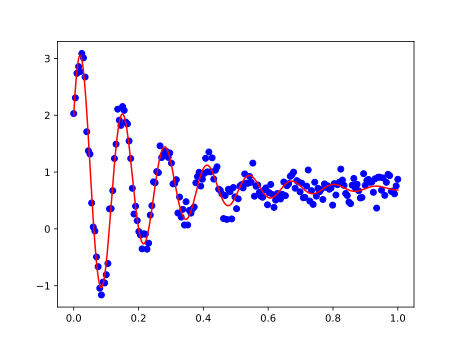

.. _nlf-damped-oscillator:

===============
Composite Model
===============
In this example, a composite model is created using built-in :ref:`models <nlf-models>`
to create a model for a `damped oscillator`_ (underdamped case).

The equation for the underdamped oscillator is

.. math::

    f(x; a) = a_1 e^{-a_2 x} cos(a_3 x + a_4) + a_5

First, simulate some noisy data *(we can also see what the expected results of the*
:math:`a_i` *parameters are)*

.. code-block:: python

    import numpy as np

    x = np.linspace(0, 1, num=200)
    noise = np.random.normal(scale=0.1, size=x.size)
    y = 2.6 * np.exp(-4.3*x) * np.cos(48.3*x + 0.5) + 0.7 + noise

Next, set up the model by creating a composite model from built-in
:ref:`models <nlf-models>`, create the initial-guess parameters and apply the fit

.. code-block:: python

    from msl.nlf import ExponentialModel, CosineModel, ConstantModel

    # Create the composite model
    model = ExponentialModel() * CosineModel() + ConstantModel()

    # Equivalently, without using the built-in models, one could have explicitly written the equation
    # model = Model('a1*exp(-a2*x)*cos(a3*x+a4)+a5')

    # Create the initial-guess parameters. All are allowed to vary during the
    # fitting process and assign helpful labels
    params = model.create_parameters()
    params.add('a1', 1, False, 'amplitude')
    params.add('a2', 1, False, 'damping_coeff')
    params.add('a3', 20, False, 'frequency')
    params.add('a4', 0, False, 'phase')
    params.add('a5', 0, False, 'offset')

    # Apply the fit
    result = model.fit(x, y, params=params)

Print the result parameters *(you can compare with the expected values above, ignoring the noise)*

.. code-block:: python

    print(result.params)

.. invisible-code-block: python

    with open('docs/_static/example_damped_oscillator.txt', mode='wt') as fp:
        fp.write(str(result.params))

.. literalinclude:: _static/example_damped_oscillator.txt

The following requires Matplotlib_ to be installed, to install it run

.. code-block:: console

    pip install matplotlib

Using the :meth:`~msl.nlf.model.Model.evaluate()` method, plot the data and the fit curve

.. code-block:: python

    import matplotlib.pyplot as plt

    # Evaluate the fit curve from the "result" object
    x_fit = np.linspace(np.min(x), np.max(x), num=1000)
    y_fit = model.evaluate(x_fit, result)

    # Plot the data and the fit
    plt.scatter(x, y, c='blue')
    plt.plot(x_fit, y_fit, c='red')
    plt.show()

.. invisible-code-block: python

    plt.savefig('docs/_static/example_damped_oscillator.svg')
    plt.clf()

.. _Matplotlib: https://matplotlib.org/
.. _damped oscillator: http://hyperphysics.phy-astr.gsu.edu/hbase/oscda.html
