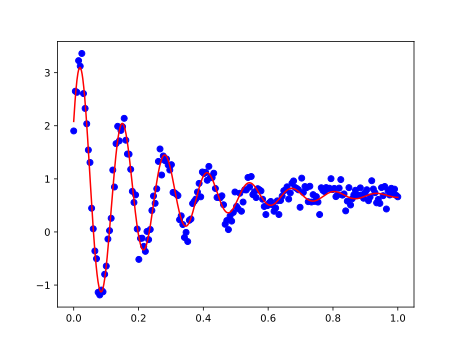

In this example, a composite model is created using built-in [models](../api/models.md) to create a model for a [damped oscillator](http://hyperphysics.phy-astr.gsu.edu/hbase/oscda.html) (underdamped case).

The equation for the underdamped oscillator is

$$
f(x; a) = a_1 e^{-a_2 x} \sin(a_3 x + a_4) + a_5
$$

First, simulate some noisy data *(we can also see what the expected results of the $a_i$ parameters are)*

```python
import numpy as np

x = np.linspace(0, 1, num=200)
noise = np.random.normal(scale=0.15, size=x.size)
y = 2.6 * np.exp(-4.3*x) * np.sin(48.3*x + 0.5) + 0.7 + noise
```

Next, set up the model by creating a composite model from built-in [models](../api/models.md), create the initial-guess parameters and apply the fit

```python
from msl.nlf import ExponentialModel, SineModel, ConstantModel

# Create the composite model
model = ExponentialModel() * SineModel() + ConstantModel()

# Equivalently, one could have explicitly written the equation
# model = Model("a1*exp(-a2*x)*sin(a3*x+a4)+a5")

# Create the initial-guess parameters. All are allowed to vary during the
# fitting process and assign helpful labels
params = model.create_parameters()
params["a1"] = 1, False, "amplitude"
params["a2"] = 1, False, "damping"
params["a3"] = 10, False, "omega"
params["a4"] = 0, False, "phase"
params["a5"] = 0, False, "offset"

# Apply the fit
result = model.fit(x, y, params=params)
```

Print the result parameters *(you can compare with the expected values above, ignoring the noise)*

```python
print(result.params)
```

<!-- invisible-code-block: python
with open("docs/assets/example_damped_oscillator.txt", mode="wt") as fp:
    fp.write(str(result.params))
-->

```py
--8<-- "docs/assets/example_damped_oscillator.txt"
```

The following requires [Matplotlib](https://matplotlib.org/){:target="_blank"} to be installed. If it is not already install, you may run

```console
pip install matplotlib
```

Using the [evaluate][msl.nlf.model.Model.evaluate] method, plot the data and the fit curve

```python
import matplotlib.pyplot as plt

# Evaluate the fit curve from the "result" object
x_fit = np.linspace(np.min(x), np.max(x), num=1000)
y_fit = model.evaluate(x_fit, result)

# Plot the data and the fit
plt.scatter(x, y, c="blue")
plt.plot(x_fit, y_fit, c="red")
plt.show()
```

<!-- invisible-code-block: python
plt.savefig("docs/assets/images/example_damped_oscillator.svg")
plt.clf()
-->

<p align="center">
  
</p>