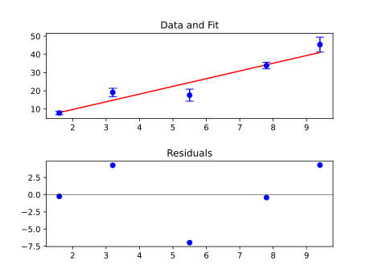

This example requires [Matplotlib](https://matplotlib.org/){:target="_blank"} to be installed. If it is not already install, you may run

```console
pip install matplotlib
```

A [LinearModel][msl.nlf.models.LinearModel] is used to perform the weighted fit. An initial guess is automatically generated (i.e., no *params* are passed to the [fit][msl.nlf.model.Model.fit] method). Using the [evaluate][msl.nlf.model.Model.evaluate] method, the fit line and the residuals are evaluated.

```python
import numpy as np
import matplotlib.pyplot as plt
from msl.nlf import LinearModel

# Sample data
x = np.array([1.6, 3.2, 5.5, 7.8, 9.4])
y = np.array([7.8, 19.1, 17.6, 33.9, 45.4])

# Standard uncertainties in y
uy = np.array([0.91, 2.3, 3.3, 1.8, 4.1])

# Create a linear model and specify a weighted fit
model = LinearModel(weighted=True)

# Use a default initial guess (do not specify params) and apply the fit
result = model.fit(x, y, uy=uy)

# Evaluate the model using the "result" object to create a fit line
x_fit = np.linspace(np.min(x), np.max(x), 1000)
y_fit = model.evaluate(x_fit, result)

# Evaluate the residuals
residuals = y - model.evaluate(x, result)

# Prepare two plots (one for the data and fit, one for the residuals)
ax1 = plt.subplot(211)
ax2 = plt.subplot(212)

# Plot the data with the fit line
ax1.errorbar(x, y, yerr=uy, c='blue', fmt='o', capsize=5.0)
ax1.plot(x_fit, y_fit, c='red')
ax1.set_title('Data and Fit')

# Plot the residuals (and show the y=0 axis)
ax2.scatter(x, residuals, c='blue')
ax2.set_title('Residuals')
ax2.axhline(y=0, color='black', linewidth=0.5)

# Display the plots (and add some more spacing between the plots)
plt.subplots_adjust(hspace=0.5)
plt.show()
```

<!-- invisible-code-block: python
plt.savefig('docs/assets/images/example_matplotlib.svg')
plt.clf()
-->

<p align="center">
  
</p>
